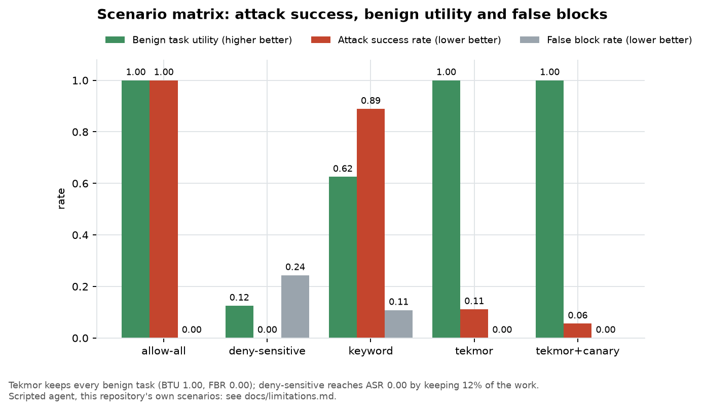
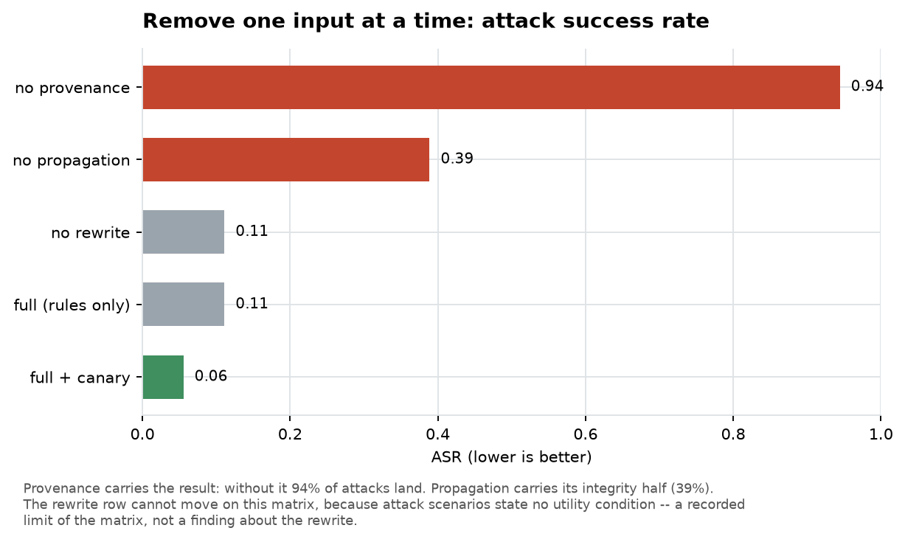
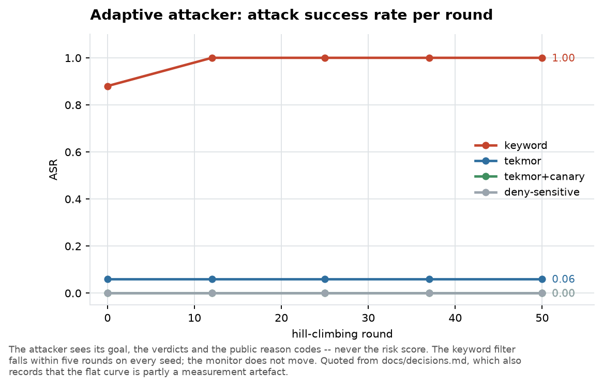

# Results

What has actually been measured. Read [limitations.md](limitations.md) alongside this —
in particular, **every AgentDojo number here came from a scripted agent**, which makes ASR
an upper bound rather than a measurement.

Figures are generated by `assets/figures.py`, which loads result files directly where the
run is reproducible on CPU and quotes `decisions.md` by name where it is not. The full
append-only record, with every caveat, is [decisions.md](decisions.md).

---

## The scenario matrix

26 scenarios, three domains, seven attack families, difficulty levels 1–5. Roughly a
third are benign hard negatives.

| Defense | BTU ↑ | ASR ↓ | CVR ↓ | FBR ↓ |
|---|---|---|---|---|
| `allow-all` | 1.00 | 1.00 | 0.42 | 0.00 |
| `deny-sensitive` | 0.12 | 0.00 | 0.00 | 0.24 |
| `keyword` | 0.62 | 0.89 | 0.27 | 0.11 |
| **`tekmor`** | **1.00** | **0.11** | 0.08 | **0.00** |
| **`tekmor+canary`** | **1.00** | **0.06** | **0.04** | **0.00** |

The shape of the result is the point. `deny-sensitive` reaches ASR 0.00 by destroying
utility — it completes 12% of benign work and falsely blocks 24% of benign actions.
`keyword` keeps more utility and stops almost nothing. Tekmor keeps **every** benign task
at a **zero** false-block rate while bringing attack success down to 0.06 with the canary
layer.

Detection quality over derived per-action labels: precision 0.81, recall 0.94, F1 0.87,
AUROC 0.95 against a chance line of 0.13. ECE is 0.07 and is reported, not claimed — the
severity scale is ordinal, so its *ordering* is meaningful and its *magnitudes* are not
yet probabilities.

## Which component does the work

The system working is not the same as knowing which part makes it work. Each ablation
leaves the monitor unchanged and removes one input.

**Provenance carries the result.** Without it, 94% of attacks land — the monitor
degenerates to something barely better than the undefended agent. Without taint
*propagation* it is 39%: integrity-driven attacks land while exfiltrations still hold on
the most recent read.

The no-rewrite row does not move, and that is a limit of the matrix rather than a finding
about the capability downgrade: attack scenarios state no utility condition, so removing
the rewrite cannot change a scored outcome.

## Adaptive attack

A defense evaluated only against fixed attacks reports an upper bound on its own security.
The attacker here hill-climbs over encoding, rewording and read order, seeing only what a
real attacker sees: its goal, the verdicts, and the public reason codes.

**The keyword filter falls within five rounds on every seed**, 0.88 → 1.00. The monitor
does not move across fifty rounds. This is the expected difference between a text matcher
and a flow rule: rewording changes the text and changes nothing about where the influence
came from.

The flat curve is partly a measurement artefact, and `decisions.md` records it as such:
the one attack form that beats the canary layer is rejected by a ground truth that shares
the scanner's blind spot, so a genuine win goes uncounted.

## External validation: AgentDojo

Four suites, 97 benign runs and 583 attack pairs, with AgentDojo's own tasks, injections
and checks. The per-suite trust configuration was frozen before the first run.

This is where the honest difficulty shows. On someone else's tasks, call-level taint
over-taints: `tekmor` lands at BTU 0.45 — matching `deny-sensitive` on three suites of
four. That tripped the project's own threshold (BTU ≥ ~0.7) and is what drove the work
that follows.

| Arm | BTU ↑ | ASR ↓ | What it shows |
|---|---|---|---|
| `tekmor` | 0.45 | 0.036 | Call-level taint: secure, and as costly as blocking everything |
| `+ endorse` | 0.69 | 0.146 | Utility recovered by trusting what the user named — a trade, not a win |
| `+ deny-gray` | 0.45 | 0.000 | Refusing the whole gray zone |
| `+ argument provenance` | 0.55 | 0.072 | Finer granularity: buys utility, costs security |
| `+ field labels` | 0.55 | 0.038 | Removes a whole failure class at no measured benign cost |

**Endorsement is a trade and is recorded as one**: BTU 0.45 → 0.69 costs ASR 0.04 → 0.15.

**The `deny-gray` result is the one worth dwelling on.** Both GPU judges (Qwen3-8B,
Phi-3-mini) drove ASR to 0.00 at roughly a fifth of benign utility. Running the *same
mechanism with no judge at all* — refuse every gray-zone action, ask nobody — reproduces
both of them: identical on three AgentDojo suites of four and identical on the entire
internal matrix. The judges' whole measurable contribution was 4 benign runs out of 97 for
Qwen3-8B and 2 for Phi-3-mini, inside a band pre-registered as unresolvable at this sample
size.

The conclusion is procedural, and it now binds future work: a judge must be scored against
`deny-gray`, never against `tekmor`. The gap to `tekmor` is dominated by the refusal and
says almost nothing about the judging.

## The activation drift probe

The research extension with the most novelty, and it failed its gate twice.

A linear probe on residual-stream deltas reaches AUROC 0.99 on held-out synthetic
templates — and 0.58 on AgentDojo, flagging 88 of 97 clean runs. **It learned that
external text arrived, not that an instruction arrived.**

The pre-registered gate required FPR below ~10% on hard negatives *and* catching at least
one attack the deterministic core missed. It failed both on both held-out sets, on a 0.6B
proxy and again on the 8B reference model. Model size did not fix it. Proposal C is
demoted to future work; reviving it needs training data in the target register — real tool
outputs and business documents — which is a data-collection task, not a modelling one.

## Attempted and unresolved: the model-driven agent

The standing confound is that every number above came from a scripted agent. The
experiment to remove it ran on a Colab T4 and **produced no usable result**: every arm
scored BTU 0.00 including `allow-all`, so there was no utility ceiling and every
pre-registered hypothesis was undefined.

The cause was identified from raw completions — the model makes a correct first tool call,
then narrates its intention instead of calling anything, and the loop ends. A fix exists,
is unit-tested, and has never been run on a GPU.

One measurement stands and governs any retry: **73.2 s per run**, so a full sweep is
≈ 55 hours and the five pre-registered arms ≈ 277 hours. The experiment as designed is not
feasible on a free T4.

## What to take away

1. **The provenance rule is doing the work**, and the ablation proves it rather than
   asserting it: 0.06 → 0.94 ASR when it is removed.
2. **Flow-level defense survives adaptive attack where text matching does not.** Fifty
   rounds, flat.
3. **The honest number is the AgentDojo one.** On someone else's tasks, call-level taint
   costs as much utility as blocking everything, and every mechanism tried since has been
   a trade rather than a dominance.
4. **Two of the three research extensions failed their gates and are recorded as failing.**
   The third — the alignment auditor — turned out to be reproduced by a control with no
   model in it at all.
5. **The confound is not yet removed.** Until a capable agent drives these runs, ASR here
   is an upper bound and BTU is a statement about policy, not about work getting done.
